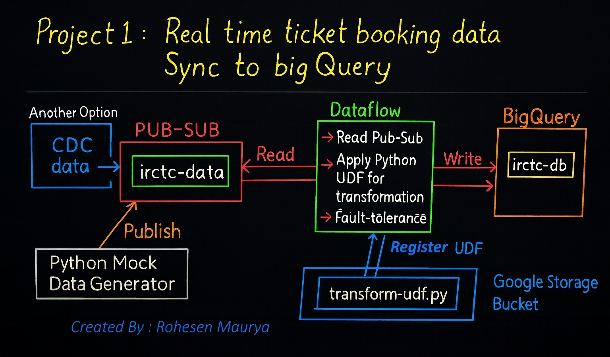
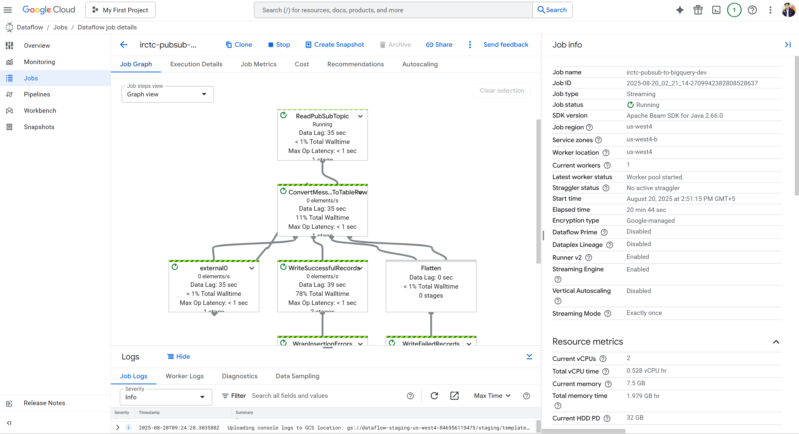

# 🚄 IRCTC Streaming Data Pipeline — GCP (Pub/Sub → Dataflow → BigQuery)

This project demonstrates a **real-time data ingestion pipeline** that ingests mock IRCTC data into **BigQuery** using **Google Cloud Pub/Sub**, **Google Cloud Dataflow (with Python UDF transformation)**, and **BigQuery**.

---

## 📌 Architecture



1. **Mock Data Generator**  
   - Generates synthetic IRCTC passenger/booking records.  
   - Publishes JSON messages into a Pub/Sub topic.

2. **Pub/Sub Topic**  
   - Serves as the streaming ingestion entry point.

3. **Dataflow Template with Python UDF**  
   - Reads data directly from Pub/Sub.  
   - Applies a **Python UDF (`transform_data`)** for:
     - Cleaning & validation  
     - Normalization of timestamps & booleans  
     - Enrichment (loyalty status, account age)  
   - Writes curated rows into BigQuery.

4. **BigQuery**  
   - Stores transformed data for analytics, dashboards, and querying. 

---

## 🛠️ Tech Stack
- **Google Cloud Pub/Sub** – Event ingestion  
- **Google Cloud Dataflow** – Managed data processing (streaming job)  
- **BigQuery** – Data warehouse  
- **Cloud Storage** – Temporary storage for Dataflow jobs  
- **Python 3.10+** – For UDF + mock data publisher   

---

## 📂 Repository Structure
```

├── create_bigquery_table.sql   # BigQuery schema definition
├── transform_udf.py            # Python UDF for cleaning & enrichment
├── irctc_mock_data_to_pubsub.py# Mock data generator & publisher
└── README.md                   # Project documentation

````

---

## 🏗️ Setup & Deployment

### 1. Create GCP Resources
```bash
# Variables
PROJECT=your-gcp-project
REGION=your-region
BUCKET=your-bucket

gcloud config set project $PROJECT

# Pub/Sub topic
gcloud pubsub topics create irctc-data

# BigQuery dataset & table
bq mk --dataset $PROJECT:irctc_dwh
bq query --use_legacy_sql=false < bigquery_create_table.sql

# Cloud Storage bucket
gsutil mb -l $REGION gs://$BUCKET
```

### 2. Install Python Dependencies

```bash
pip install google-cloud-pubsub
```

### 3. Publish Mock Data

```bash
python irctc_mock_data_to_pubsub.py
```

### 4. Run Dataflow Pipeline

```bash
python pipeline.py \
  --project $PROJECT \
  --region $REGION \
  --runner DataflowRunner \
  --input_topic projects/$PROJECT/topics/irctc-data \
  --output_table $PROJECT:irctc_dwh.irctc_stream_tb \
  --staging_location gs://$BUCKET/staging \
  --temp_location gs://$BUCKET/temp
```



---

## 🧹 Data Transformation (UDF Highlights)

The `transform_data` UDF:

* Cleans & normalizes data:

  * Ensures `name` is capitalized, `email` is lowercase.
  * Converts `is_active` to boolean.
* Enriches records:

  * Adds `loyalty_status` (Platinum vs Standard).
  * Calculates `account_age_days` from `join_date`.
* Validates timestamps (`inserted_at`, `updated_at`, `last_login`) with safe defaults.

---

## 📊 Sample Query in BigQuery

```sql
SELECT
  station_code,
  AVG(delay_minutes) AS avg_delay
FROM `your-project.irctc_dwh.irctc_stream_tb`
WHERE inserted_at >= TIMESTAMP_SUB(CURRENT_TIMESTAMP(), INTERVAL 1 HOUR)
GROUP BY station_code
ORDER BY avg_delay DESC;
```

---

## 🚀 Future Enhancements

* Add **dead-letter queue (DLQ)** for bad records.
* Use **clustering & partitioning** in BigQuery.
* Build **real-time dashboards** using Looker Studio.
* Implement **service accounts with least privilege** for Dataflow workers.

---

## 🧑‍💻 Author

Developed as a hands-on project to demonstrate streaming ETL on GCP with Pub/Sub, Dataflow (Python UDF), and BigQuery.
